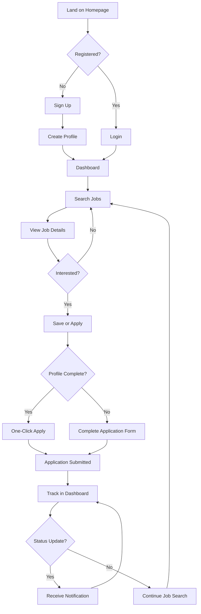
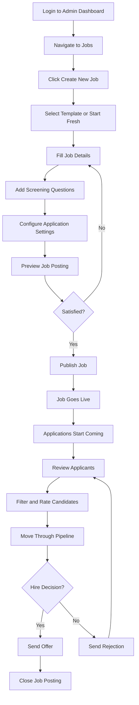
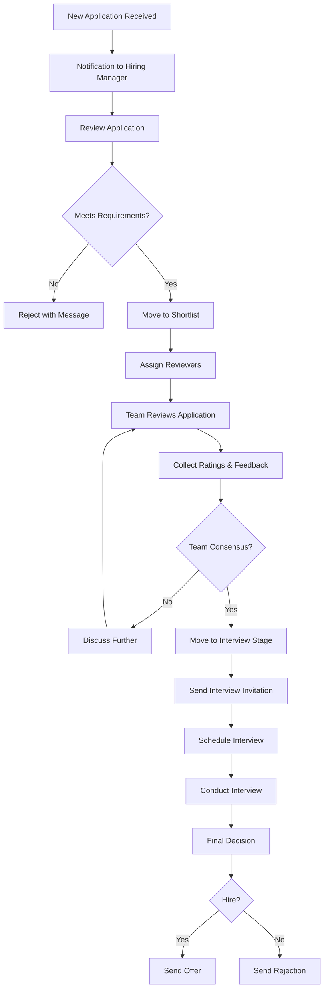
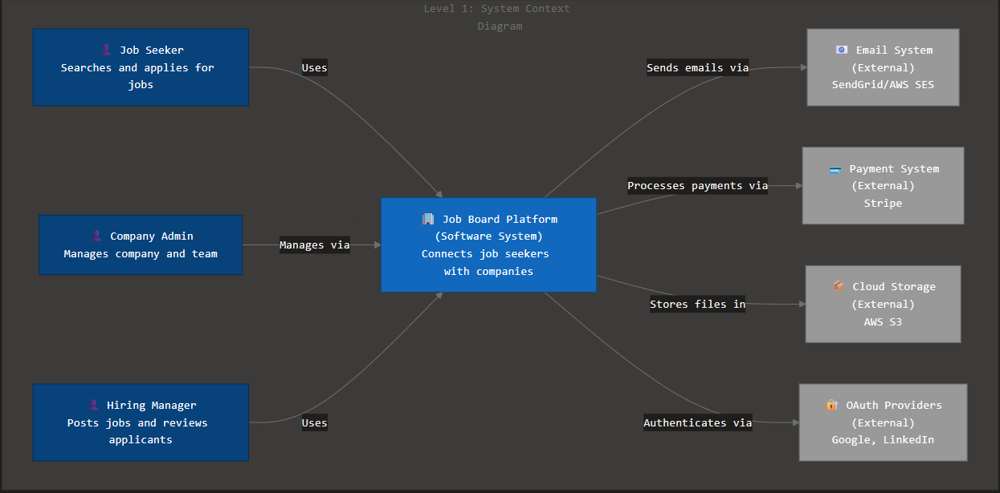

# Product Requirements Document
## Job Board Platform - Version 1.0

### Document Information
- **Product**: Job Board Platform (Job Seeker App + Admin Dashboard)
- **Version**: 1.0
- **Date**: January 10, 2026
- **Owner**: Product Manager
- **Status**: Draft
- **Last Updated**: January 10, 2026

---

### 1. Product Overview

#### 1.1 Vision Statement
To create the most efficient and user-friendly job board platform that connects talented job seekers with forward-thinking companies through intelligent matching, streamlined application processes, and comprehensive administrative tools that empower hiring teams to find their ideal candidates.

#### 1.2 Product Mission
Our platform bridges the gap between job seekers and employers by providing an intuitive mobile-first experience for candidates to discover and apply for opportunities, while giving companies powerful administrative tools to manage job postings, track applications, and collaborate effectively throughout the hiring process.

#### 1.3 Target Market
- **Primary Market**: Small to medium-sized businesses (10-500 employees) seeking quality candidates and active job seekers in tech, business, and professional services sectors. Market size: $5.2B globally
- **Secondary Markets**: Recruitment agencies, freelance platforms, enterprise HR departments
- **Market Trends**:
    - 72% of job seekers use mobile devices for job search
    - Companies prioritizing applicant tracking system (ATS) integration
    - Growing demand for remote and hybrid work options
    - AI-powered candidate matching gaining adoption

---

### 2. User Research and Personas

#### 2.1 Primary Personas

**Persona 1: Active Job Seeker (Sarah)**
- **Role**: Marketing Specialist looking for career advancement
- **Demographics**: 28 years old, 5 years experience, intermediate technical skills, mobile-first user
- **Goals**:
    - Find relevant job opportunities matching her skills and salary expectations
    - Apply to multiple positions quickly without repetitive data entry
    - Track application status and receive timely updates
    - Showcase portfolio and accomplishments effectively
- **Pain Points**:
    - Applying to jobs requires filling out the same information repeatedly
    - Difficulty tracking which jobs were applied to and their status
    - Limited visibility into company culture and actual job requirements
    - Spam and irrelevant job recommendations
- **User Journey**: Browse jobs → Filter by criteria → Save interesting positions → Complete profile → Submit applications → Track status → Receive responses
- **Success Metrics**: Time to find relevant job, application completion rate, interview invitation rate

**Persona 2: Hiring Manager (Michael)**
- **Role**: Engineering Team Lead responsible for building technical team
- **Demographics**: 35 years old, 8 years management experience, high technical proficiency
- **Goals**:
    - Post job openings quickly with accurate requirements
    - Review qualified candidates efficiently
    - Collaborate with HR and team members on hiring decisions
    - Track hiring pipeline and time-to-fill metrics
- **Pain Points**:
    - Overwhelmed by unqualified applications
    - Lack of collaboration tools for team-based hiring decisions
    - Difficulty tracking candidates through multiple stages
    - Limited insights into job posting performance
- **User Journey**: Create job posting → Review applications → Filter candidates → Collaborate with team → Schedule interviews → Update candidate status → Make hiring decision
- **Success Metrics**: Quality of applicants, time-to-hire, hiring manager satisfaction score

**Persona 3: Company Administrator (Lisa)**
- **Role**: HR Director managing recruitment operations
- **Demographics**: 42 years old, 15 years HR experience, moderate technical skills
- **Goals**:
    - Manage company profile and employer brand
    - Oversee all job postings and hiring workflows
    - Grant appropriate access to hiring managers
    - Generate reports on recruitment metrics
- **Pain Points**:
    - Difficulty maintaining consistent employer brand across postings
    - Limited visibility into team hiring activities
    - Manual reporting processes are time-consuming
    - Managing user permissions is cumbersome
- **User Journey**: Set up company profile → Manage team access → Monitor all job postings → Review analytics → Generate reports → Optimize recruitment strategy
- **Success Metrics**: Overall time-to-hire, cost-per-hire, candidate quality score

#### 2.2 User Research Insights
- **Key Finding 1**: 68% of job seekers abandon applications that take more than 15 minutes to complete (Source: Candidate Experience Survey, 2024)
- **Key Finding 2**: Hiring teams with collaborative review tools reduce time-to-hire by 35% compared to email-based coordination
- **Key Finding 3**: Mobile applications account for 58% of all job applications, yet only 40% of job boards provide optimal mobile experience
- **Opportunity Areas**:
    - Streamlined one-click apply with profile auto-fill
    - Real-time collaborative candidate evaluation
    - Mobile-optimized application process
    - Predictive matching to reduce irrelevant applications

---

### 3. Product Strategy

#### 3.1 Product Goals
1. **Primary Goal**: Launch MVP within 4 months that enables 100 companies to post jobs and attracts 5,000 active job seekers with 70% mobile usage
2. **Secondary Goals**:
    - Achieve 80% application completion rate for started applications
    - Reduce average time-to-hire by 25% compared to traditional job boards
    - Maintain 4.5+ star rating from both job seekers and employers

#### 3.2 Success Metrics

| Metric | Baseline | Target | Timeframe |
|--------|----------|--------|-----------|
| Active Job Seekers | 0 | 5,000 | 4 months |
| Company Accounts | 0 | 100 | 4 months |
| Active Job Postings | 0 | 300 | 4 months |
| Application Completion Rate | 45% (industry avg) | 80% | 3 months |
| Mobile Application % | 58% (industry avg) | 75% | 4 months |
| Average Time-to-Hire | 42 days (industry avg) | 32 days | 6 months |
| User Satisfaction (NPS) | N/A | 50+ | 6 months |

#### 3.3 Key Performance Indicators (KPIs)
- **User Engagement**:
    - Daily Active Users (DAU) for Job Seekers
    - Average applications per job seeker per week
    - Job search sessions per user
    - Return user rate within 7 days
- **Business Impact**:
    - Monthly Recurring Revenue (MRR) from company subscriptions
    - Cost per acquisition (CPA) for both sides
    - Job posting fill rate
    - Platform commission per hire (if applicable)
- **Product Quality**:
    - Application load time (< 2 seconds)
    - Mobile app crash rate (< 0.5%)
    - API uptime (99.9%)
    - User satisfaction scores (CSAT)

---

### 4. Functional Requirements

#### 4.1 Core Features (Must-Have)

---

### JOB SEEKER APP FEATURES

**Feature 1: User Registration & Profile Management**
- **Description**: Job seekers create accounts and build comprehensive profiles that auto-populate job applications, eliminating repetitive data entry and improving application speed.
- **User Stories**:
    - As a job seeker, I want to create an account using email or social login so that I can quickly access the platform
    - As a job seeker, I want to build a detailed profile with my experience, education, and skills so that I can apply to jobs faster
    - As a job seeker, I want to upload my resume/CV so that my profile can be auto-populated with relevant information
    - As a job seeker, I want to add a profile photo and portfolio links so that I can showcase my professional brand
- **Acceptance Criteria**:
    - Registration via email with verification required
    - Social login options (Google, LinkedIn)
    - Profile sections: personal info, work experience, education, skills, certifications, portfolio
    - Resume upload and parsing (PDF, DOCX formats)
    - Profile completeness indicator showing percentage complete
    - Mobile-responsive profile editing interface
- **Success Metrics**: Registration completion rate >85%, profile completion rate >70%, average time to complete profile <10 minutes

**Feature 2: Job Search & Discovery**
- **Description**: Intelligent job search with multiple filter options, saved searches, and personalized recommendations to help job seekers find relevant opportunities quickly.
- **User Stories**:
    - As a job seeker, I want to search jobs by keywords, location, and category so that I can find relevant positions
    - As a job seeker, I want to filter jobs by salary range, experience level, and job type so that I can narrow results
    - As a job seeker, I want to save my search criteria so that I can quickly repeat searches
    - As a job seeker, I want to receive job recommendations based on my profile so that I don't miss opportunities
- **Acceptance Criteria**:
    - Full-text search across job titles, descriptions, and company names
    - Filters: location (with radius), salary range, job type (full-time, part-time, contract, remote), experience level, industry, company size
    - Save search functionality with email alerts option
    - Recommended jobs section based on profile matching
    - Sort options: relevance, date posted, salary, company
    - Infinite scroll with pagination
    - Search results display: job title, company, location, salary (if available), posting date, quick apply indicator
- **Success Metrics**: Average search time to first relevant result <30 seconds, search-to-apply conversion rate >15%

**Feature 3: Job Application Submission**
- **Description**: Streamlined application process with one-click apply for profile-complete users and optional custom responses for specific jobs.
- **User Stories**:
    - As a job seeker, I want to apply to jobs with one click using my profile information so that I can apply quickly
    - As a job seeker, I want to add a custom cover letter for specific applications so that I can personalize my submission
    - As a job seeker, I want to answer custom screening questions so that I can meet employer requirements
    - As a job seeker, I want to attach additional documents so that I can provide requested materials
- **Acceptance Criteria**:
    - One-click apply button for users with complete profiles
    - Auto-population of application forms from profile data
    - Optional cover letter text editor with templates
    - Custom screening questions rendered dynamically
    - Additional document uploads (max 3 files, 5MB each)
    - Application preview before submission
    - Confirmation message and email after successful submission
    - Application takes <3 minutes to complete
- **Success Metrics**: Application completion rate >80%, one-click apply usage >60%, average application time <5 minutes

**Feature 4: Application Tracking Dashboard**
- **Description**: Centralized dashboard where job seekers can view all submitted applications, track their status, and receive updates from employers.
- **User Stories**:
    - As a job seeker, I want to see all my submitted applications in one place so that I can track my job search
    - As a job seeker, I want to see the current status of each application so that I know where I stand
    - As a job seeker, I want to receive notifications when my application status changes so that I can respond promptly
    - As a job seeker, I want to withdraw applications if needed so that I can manage my active searches
- **Acceptance Criteria**:
    - Dashboard showing all applications with: company name, job title, date applied, current status
    - Status types: Submitted, Reviewing, Interview, Rejected, Accepted, Withdrawn
    - Filter and sort options for applications
    - Status change notifications (in-app and email)
    - Ability to withdraw application with confirmation
    - Application details view showing full submission
    - Company response messages displayed inline
- **Success Metrics**: Dashboard engagement rate >70%, time spent on dashboard >2 minutes per session

**Feature 5: Job Alerts & Notifications**
- **Description**: Customizable notification system to keep job seekers informed about new matching jobs, application updates, and saved search results.
- **User Stories**:
    - As a job seeker, I want to receive alerts for jobs matching my criteria so that I don't miss opportunities
    - As a job seeker, I want to control notification preferences so that I'm not overwhelmed
    - As a job seeker, I want to receive updates about my applications so that I stay informed
- **Acceptance Criteria**:
    - Email and push notification options
    - Notification types: new matching jobs, application status changes, saved search results, messages from employers
    - Frequency settings: immediate, daily digest, weekly digest
    - Granular control over notification types
    - Unsubscribe options for each notification type
    - Notification history in app
- **Success Metrics**: Notification opt-in rate >60%, notification click-through rate >25%

**Feature 6: Saved Jobs & Favorites**
- **Description**: Allow job seekers to bookmark interesting positions for later review and application.
- **User Stories**:
    - As a job seeker, I want to save jobs to review later so that I can compare opportunities
    - As a job seeker, I want to organize saved jobs so that I can prioritize applications
    - As a job seeker, I want to receive reminders about saved jobs so that I don't forget to apply
- **Acceptance Criteria**:
    - Save/unsave button on job listings
    - Saved jobs section in user profile
    - Notes field for each saved job
    - Application deadline warnings for saved jobs
    - Bulk actions (apply, remove) on saved jobs
    - Saved jobs accessible offline in mobile app
- **Success Metrics**: Average saved jobs per user >5, saved-to-apply conversion rate >40%

**Feature 7: Mobile-First Interface**
- **Description**: Responsive web application optimized for mobile devices with progressive web app (PWA) capabilities.
- **User Stories**:
    - As a job seeker, I want to access the platform from my phone so that I can search jobs anywhere
    - As a job seeker, I want a fast, app-like experience so that I can apply quickly on mobile
- **Acceptance Criteria**:
    - Fully responsive design (mobile, tablet, desktop)
    - Touch-optimized UI elements (minimum 44px tap targets)
    - PWA installation prompt for mobile browsers
    - Offline access to saved jobs and profile
    - Mobile-optimized forms and inputs
    - Fast load times (<3s on 3G connection)
    - Swipe gestures for navigation (mobile)
- **Success Metrics**: Mobile traffic >60%, mobile application completion rate >75%

---

### ADMIN DASHBOARD FEATURES

**Feature 8: Company Account Management**
- **Description**: Company administrators can create and manage company profiles, including branding, description, and team member access.
- **User Stories**:
    - As a company admin, I want to create a company profile so that job seekers can learn about our organization
    - As a company admin, I want to add company logo and branding so that our jobs are recognizable
    - As a company admin, I want to add team members with different roles so that we can collaborate on hiring
- **Acceptance Criteria**:
    - Company registration with email verification
    - Company profile fields: name, logo, industry, size, location(s), website, description, culture/values, benefits
    - Rich text editor for company description
    - Logo upload (max 2MB, PNG/JPG)
    - Multiple office locations supported
    - Social media links (LinkedIn, Twitter, Facebook)
    - Company verification badge system
- **Success Metrics**: Company profile completion rate >85%, average profile completion time <15 minutes

**Feature 9: User Role & Permission Management**
- **Description**: Flexible role-based access control allowing company admins to manage team members with appropriate permissions.
- **User Stories**:
    - As a company admin, I want to invite team members via email so that they can access the platform
    - As a company admin, I want to assign different roles to team members so that they have appropriate access
    - As a company admin, I want to remove or deactivate users so that I can manage team changes
- **Acceptance Criteria**:
    - Three role types: Admin (full access), Hiring Manager (job-specific access), Viewer (read-only)
    - Email invitations with registration links
    - Role assignment at invitation and editable later
    - Permission matrix clearly displayed
    - User list with status indicators (active, pending, deactivated)
    - Activity log showing user actions
    - Bulk user management capabilities
- **Success Metrics**: Average team size >3 users per company, role assignment completion >95%

**Feature 10: Job Posting Creation & Management**
- **Description**: Intuitive job posting interface with templates, rich formatting, and preview capabilities to create compelling job advertisements.
- **User Stories**:
    - As a hiring manager, I want to create job postings quickly so that I can fill positions faster
    - As a hiring manager, I want to use templates so that I maintain consistency
    - As a hiring manager, I want to preview how the job will appear so that I can ensure quality
    - As a hiring manager, I want to duplicate existing posts so that I can create similar roles efficiently
- **Acceptance Criteria**:
    - Job posting form with sections: title, location, job type, experience level, salary range, description, requirements, responsibilities, benefits
    - Rich text editor for description with formatting options
    - Job posting templates (customizable)
    - Custom screening questions (up to 5 questions)
    - Application deadline setting
    - Required vs. optional application fields configuration
    - Preview mode showing candidate view
    - Save as draft functionality
    - Duplicate job posting feature
    - Publish/unpublish controls
- **Success Metrics**: Average time to create job posting <10 minutes, job posting completion rate >90%

**Feature 11: Applicant Tracking & Review**
- **Description**: Comprehensive applicant management system allowing hiring teams to review, filter, and track candidates through the hiring pipeline.
- **User Stories**:
    - As a hiring manager, I want to see all applications for my job postings so that I can review candidates
    - As a hiring manager, I want to filter applicants by qualifications so that I can find the best matches
    - As a hiring manager, I want to move candidates through stages so that I can track progress
    - As a hiring manager, I want to add notes and ratings so that I can remember my evaluation
- **Acceptance Criteria**:
    - Applicant list view with key information: name, applied date, status, rating
    - Detailed applicant profile view with full application, resume, and documents
    - Filter options: status, rating, date applied, experience level, skills
    - Drag-and-drop kanban board for status management
    - Status pipeline: New → Reviewing → Shortlisted → Interview → Offer → Hired/Rejected
    - Star rating system (1-5 stars)
    - Private notes field per applicant
    - Bulk actions (status change, send message)
    - Resume viewer with download option
    - Application comparison view (side-by-side)
- **Success Metrics**: Average review time per applicant <3 minutes, applicant response rate within 48 hours >70%

**Feature 12: Collaboration & Team Review**
- **Description**: Enable hiring teams to collaborate on candidate evaluation with shared notes, ratings, and decision-making workflows.
- **User Stories**:
    - As a hiring manager, I want to share applicants with team members so that we can evaluate together
    - As a team member, I want to see colleague ratings and feedback so that we can make informed decisions
    - As a hiring manager, I want to request feedback from specific team members so that I get required input
- **Acceptance Criteria**:
    - Assign reviewers to specific applicants
    - Shared notes visible to all assigned reviewers
    - Individual ratings aggregated into average score
    - Comment threads on applicant profiles
    - Feedback request notifications
    - Review status indicators (pending, completed)
    - Decision workflow with approval gates
    - Activity timeline showing all team interactions
- **Success Metrics**: Collaboration feature usage >50% of companies, average reviewers per candidate >2

**Feature 13: Communication Tools**
- **Description**: In-platform messaging system for communicating with candidates, sending interview invitations, and providing updates.
- **User Stories**:
    - As a hiring manager, I want to message candidates directly so that I can request additional information
    - As a hiring manager, I want to send interview invitations so that I can schedule meetings
    - As a hiring manager, I want to use templates so that I can communicate efficiently
- **Acceptance Criteria**:
    - Message composer with rich text formatting
    - Message templates for common communications (rejection, interview invitation, information request)
    - Template variables (candidate name, job title, company name)
    - Bulk messaging to multiple candidates
    - Message history per applicant
    - Email notification to candidates for new messages
    - Response tracking and read receipts
    - Quick actions (schedule interview, send rejection)
- **Success Metrics**: Response time to candidates <24 hours, message template usage >70%

**Feature 14: Analytics & Reporting**
- **Description**: Comprehensive analytics dashboard providing insights into job posting performance, applicant pipeline, and recruitment metrics.
- **User Stories**:
    - As a company admin, I want to see recruitment metrics so that I can evaluate our hiring effectiveness
    - As a hiring manager, I want to see job posting performance so that I can optimize listings
    - As a company admin, I want to generate reports so that I can share with leadership
- **Acceptance Criteria**:
    - Dashboard with key metrics: active jobs, total applications, time-to-hire, applicant sources
    - Job posting analytics: views, applications, application rate, time to fill
    - Applicant pipeline funnel visualization
    - Team performance metrics (applications reviewed, time-to-respond)
    - Date range filters and comparison periods
    - Export reports to PDF and CSV
    - Custom report builder (basic)
    - Scheduled report delivery via email
- **Success Metrics**: Dashboard usage >80% of active companies, report generation >2 times per month per company

**Feature 15: Job Posting Management Dashboard**
- **Description**: Centralized view of all company job postings with status indicators, performance metrics, and quick actions.
- **User Stories**:
    - As a hiring manager, I want to see all my active job postings so that I can monitor them
    - As a company admin, I want to see all company jobs so that I can oversee recruitment
    - As a hiring manager, I want to quickly edit or close positions so that I can respond to changes
- **Acceptance Criteria**:
    - List view and grid view options
    - Job posting cards showing: title, status, applications count, views, date posted
    - Status indicators: Draft, Active, Paused, Closed, Expired
    - Quick actions: edit, pause, close, duplicate, view applications
    - Search and filter by: status, hiring manager, department, date range
    - Sort options: newest, most applications, most views
    - Bulk actions on multiple job postings
    - Application distribution visualization per job
- **Success Metrics**: Dashboard engagement >5 times per week per hiring manager

---

#### 4.2 Enhanced Features (Should-Have)

**Job Seeker App:**
- Advanced profile features: video introduction, skill assessments, work samples gallery
- AI-powered resume builder and optimization suggestions
- Salary insights and negotiation tools
- Company reviews and ratings from employees
- Interview preparation resources and tips
- Career path recommendations
- Skill gap analysis with learning recommendations
- Application tracking with interview scheduling integration
- Referral bonus program for successful hires

**Admin Dashboard:**
- Branded career page builder
- Custom application forms per job posting
- Video interview integration (e.g., Zoom, Teams)
- Automated candidate screening with AI matching scores
- Chrome extension for sourcing candidates from LinkedIn
- Email campaign builder for talent pipeline
- Integration with HR systems (BambooHR, Workday)
- Advanced analytics: source effectiveness, diversity metrics, competitive benchmarking
- Candidate relationship management (CRM) features
- Interview scheduling automation
- Offer letter generation and e-signature
- Background check integration

#### 4.3 Future Features (Nice-to-Have)

**Job Seeker App:**
- AI chatbot for job search assistance
- Gamification with achievements and badges
- Networking features (connect with other job seekers)
- Salary calculator with market comparisons
- Live job fairs and virtual events
- Career coaching marketplace
- Freelance/gig work opportunities section
- Application practice simulator with AI feedback
- Anonymous profile viewing by employers

**Admin Dashboard:**
- Predictive analytics for hiring success
- Diversity and inclusion tracking tools
- Employee referral portal
- Advanced workflow automation with conditional logic
- Multi-language support for international hiring
- API access for custom integrations
- White-label platform for recruitment agencies
- Advanced security features (SSO, 2FA)
- Headcount planning and budget management tools

---


### SYSTEM ADMINISTRATION FEATURES

**Feature 16: System Administration & Platform Management**
- **Description**: Comprehensive platform-level controls for system administrators to manage all companies, users, content, and platform configurations.
- **User Stories**:
    - As a system admin, I want to view all companies and users so that I can monitor platform activity
    - As a system admin, I want to suspend or verify accounts so that I can maintain platform quality
    - As a system admin, I want to configure platform-wide settings so that I can control system behavior
    - As a system admin, I want to moderate content so that I can ensure policy compliance
    - As a system admin, I want to access comprehensive analytics so that I can track platform health
    - As a system admin, I want to manage user support tickets so that I can resolve issues efficiently
    - As a system admin, I want to detect and prevent fraudulent activity so that I can protect users
    - As a system admin, I want to perform bulk operations so that I can manage the platform efficiently
- **Acceptance Criteria**:
    - Super admin dashboard with platform-wide metrics: total users, active companies, job postings, applications, revenue, system health
    - Company management: list all companies, view details, verify/suspend accounts, edit company profiles, bulk actions
    - User management: search all users (job seekers and company users), view activity logs, suspend/activate accounts, reset passwords, manage verification status
    - Content moderation: flagged job postings review queue, inappropriate content removal, automated filtering rules configuration, manual review interface
    - Platform settings: email templates management, notification defaults, feature toggles, maintenance mode, API configuration, rate limits
    - Support ticket system: view all tickets with filtering, assign to team members, respond with templates, track resolution time, escalation workflows
    - Advanced analytics: user growth trends, engagement metrics by segment, revenue reports, churn analysis, system performance dashboards
    - Audit logs: comprehensive activity tracking across all users and companies, immutable log storage, advanced search and filtering
    - Bulk operations: bulk email to companies/users, bulk status updates, data exports (CSV, JSON), scheduled tasks
    - System health monitoring: server status, database performance metrics, error logs with stack traces, API usage by endpoint, queue status
    - Fraud detection: suspicious activity alerts, duplicate account detection, pattern analysis, IP tracking, automated blocking rules
    - Company verification workflow: review verification requests, approve/reject with reasons, verification badge management
- **Success Metrics**: Average support ticket resolution time <2 hours, platform uptime 99.9%+, fraud detection accuracy >95%, content moderation response time <1 hour

**Feature 17: System Administrator Access Control**
- **Description**: Secure authentication and authorization system specifically for system administrators with enhanced security measures.
- **User Stories**:
    - As a system admin, I want to log in securely with two-factor authentication so that my account is protected
    - As a system admin, I want to see audit trails of all admin actions so that we maintain accountability
    - As a lead admin, I want to manage other admin users and their permissions so that I can control access
- **Acceptance Criteria**:
    - Separate authentication realm for system administrators
    - Mandatory two-factor authentication (2FA) for all system admin accounts
    - IP whitelist restrictions with configurable allowed IPs
    - Session timeout after 30 minutes of inactivity
    - All administrative actions logged to immutable audit trail with timestamps, user, action, and affected resources
    - Emergency access protocols with multi-person approval workflow
    - Privileged access management (PAM) for sensitive operations requiring approval
    - Admin user management: create, edit, deactivate admin accounts
    - Granular permission assignment for admin roles (e.g., support-only, content moderator, super admin)
    - Login history and session management for all admin users
    - Automated alerts for suspicious admin activity
- **Success Metrics**: Zero unauthorized access incidents, 100% admin action logging, 2FA adoption rate 100%

**Feature 18: Platform Analytics & Business Intelligence**
- **Description**: Advanced analytics and reporting capabilities for platform-wide business intelligence and strategic decision-making.
- **User Stories**:
    - As a system admin, I want to see platform growth metrics so that I can track business performance
    - As a system admin, I want to identify usage patterns so that I can optimize features
    - As a system admin, I want to generate executive reports so that I can inform stakeholders
- **Acceptance Criteria**:
    - Real-time dashboard with key business metrics: DAU/MAU, revenue, growth rates, conversion funnels
    - User segmentation analysis: by industry, company size, location, user behavior
    - Cohort analysis for retention tracking
    - Funnel analysis for registration, job posting, and application flows
    - Revenue analytics: MRR, ARR, churn rate, LTV, subscription trends
    - Geographic heatmaps for user distribution
    - Feature usage analytics to identify popular and underutilized features
    - A/B test results dashboard
    - Custom report builder with drag-and-drop interface
    - Scheduled report delivery to stakeholders
    - Data export capabilities (CSV, Excel, PDF)
    - Integration with business intelligence tools (optional)
- **Success Metrics**: Weekly executive report generation, data-driven decision increase by 50%

---

#### 4.2 Enhanced Features (Should-Have)

**Job Seeker App:**
- Advanced profile features: video introduction, skill assessments, work samples gallery
- AI-powered resume builder and optimization suggestions
- Salary insights and negotiation tools
- Company reviews and ratings from employees
- Interview preparation resources and tips
- Career path recommendations
- Skill gap analysis with learning recommendations
- Application tracking with interview scheduling integration
- Referral bonus program for successful hires

**Admin Dashboard:**
- Branded career page builder
- Custom application forms per job posting
- Video interview integration (e.g., Zoom, Teams)
- Automated candidate screening with AI matching scores
- Chrome extension for sourcing candidates from LinkedIn
- Email campaign builder for talent pipeline
- Integration with HR systems (BambooHR, Workday)
- Advanced analytics: source effectiveness, diversity metrics, competitive benchmarking
- Candidate relationship management (CRM) features
- Interview scheduling automation
- Offer letter generation and e-signature
- Background check integration

**System Administration:**
- Advanced fraud detection with machine learning models
- Automated content moderation with AI (natural language processing)
- Custom email campaign builder for platform announcements
- A/B testing framework for platform features with statistical analysis
- Advanced reporting with customizable dashboards
- API usage monitoring and dynamic rate limit management
- User impersonation for support troubleshooting (with audit logging)
- Automated onboarding workflows for companies
- Payment and billing management across all companies
- License and subscription tier management
- Multi-tenant configuration management
- Compliance reporting (GDPR, CCPA data requests)
- Platform performance optimization tools
- Automated backup verification and disaster recovery testing

#### 4.3 Future Features (Nice-to-Have)

**Job Seeker App:**
- AI chatbot for job search assistance
- Gamification with achievements and badges
- Networking features (connect with other job seekers)
- Salary calculator with market comparisons
- Live job fairs and virtual events
- Career coaching marketplace
- Freelance/gig work opportunities section
- Application practice simulator with AI feedback
- Anonymous profile viewing by employers

**Admin Dashboard:**
- Predictive analytics for hiring success
- Diversity and inclusion tracking tools
- Employee referral portal
- Advanced workflow automation with conditional logic
- Multi-language support for international hiring
- API access for custom integrations
- White-label platform for recruitment agencies
- Advanced security features (SSO, advanced 2FA)
- Headcount planning and budget management tools

**System Administration:**
- Machine learning-powered anomaly detection
- Predictive churn modeling
- Automated platform scaling recommendations
- Advanced threat intelligence integration
- Blockchain-based audit logging
- Multi-region deployment management
- Automated compliance audit generation
- Real-time platform status page for users
- Advanced disaster recovery orchestration

---


### 5. Non-Functional Requirements

#### 5.1 Performance Requirements
- **Response Time**:
    - Page load time: <2 seconds for 95th percentile
    - API response time: <500ms for 95th percentile
    - Search results: <1 second for most queries
    - Application submission: <3 seconds
- **Throughput**:
    - Support 10,000 concurrent users initially
    - Handle 1,000 job applications per hour
    - Process 5,000 searches per minute during peak hours
- **Availability**:
    - 99.9% uptime (less than 8.7 hours downtime per year)
    - Scheduled maintenance windows during low-traffic hours (2-4 AM local time)
    - Zero data loss guarantee
- **Scalability**:
    - Architecture supports horizontal scaling
    - Database optimization for 1M+ job seekers and 10,000+ companies
    - CDN integration for static assets and media
    - Auto-scaling during traffic spikes

#### 5.2 Security Requirements
- **Authentication**:
    - Email/password with bcrypt hashing (cost factor 12)
    - OAuth 2.0 for social logins (Google, LinkedIn)
    - Session management with secure, httpOnly cookies
    - Password requirements: minimum 8 characters, complexity rules
    - Account lockout after 5 failed login attempts
    - Password reset via email with time-limited tokens
- **Authorization**:
    - Role-based access control (RBAC) using Laravel policies
    - Row-level security for company data isolation
    - API rate limiting per user/IP
    - JWT tokens for API authentication with short expiration
- **Data Protection**:
    - HTTPS/TLS 1.3 for all connections
    - Database encryption at rest (AES-256)
    - Personal data encryption for sensitive fields (SSN, salary expectations)
    - Regular automated backups (daily with 30-day retention)
    - GDPR compliance: right to access, right to deletion, data portability
    - File upload scanning for malware
    - SQL injection prevention via parameterized queries
    - XSS protection via input sanitization and output encoding
    - CSRF protection on all forms
- **Compliance**:
    - GDPR (European Union)
    - CCPA (California Consumer Privacy Act)
    - SOC 2 Type II readiness
    - Equal Employment Opportunity (EEO) compliance
    - Data retention policies documented and enforced

#### 5.3 Usability Requirements
- **Accessibility**:
    - WCAG 2.1 Level AA compliance
    - Keyboard navigation support throughout
    - Screen reader compatibility (ARIA labels)
    - Color contrast ratios meeting accessibility standards
    - Alt text for all images and meaningful graphics
    - Form labels and error messages clearly associated
    - Focus indicators visible on all interactive elements
- **User Experience**:
    - Mobile-first design approach
    - Maximum 3 clicks to reach any feature
    - Consistent UI patterns across platform
    - Inline validation with helpful error messages
    - Loading indicators for all asynchronous operations
    - Tooltips and contextual help throughout
    - Onboarding tutorials for new users
    - Empty states with clear calls-to-action
- **Multi-platform**:
    - Responsive web design (320px to 4K displays)
    - Browser support: Chrome 90+, Firefox 88+, Safari 14+, Edge 90+
    - Progressive Web App (PWA) for mobile installation
    - iOS 14+ and Android 10+ compatibility
    - Optimal performance on 3G and 4G connections
- **Localization**:
    - Initial launch: English only
    - Platform architecture supports multiple languages
    - Date/time formatting based on user locale
    - Currency display based on regional settings
    - Right-to-left (RTL) support architecture

---

### 6. User Experience Design

#### 6.1 User Workflows

**Job Seeker Application Flow:**


**Hiring Manager Job Posting Flow:**


**Applicant Review and Collaboration Flow:**


#### 6.2 Information Architecture

**Job Seeker App Navigation:**
```
Home/Dashboard
├── My Applications
│   ├── Active Applications
│   ├── Interview Scheduled
│   └── Application History
├── Job Search
│   ├── Search Results
│   ├── Saved Searches
│   └── Recommended Jobs
├── Saved Jobs
├── Profile
│   ├── Personal Information
│   ├── Work Experience
│   ├── Education
│   ├── Skills & Certifications
│   ├── Resume/CV Upload
│   └── Portfolio
├── Notifications
│   └── Notification Settings
└── Settings
    ├── Account Settings
    ├── Privacy Settings
    └── Email Preferences
```

**Admin Dashboard Navigation:**
```
Dashboard (Overview)
├── Jobs
│   ├── All Job Postings
│   ├── Create New Job
│   ├── Drafts
│   ├── Active Jobs
│   └── Closed Jobs
├── Candidates
│   ├── All Applications
│   ├── Shortlisted
│   ├── In Interview
│   └── Hired
├── Team
│   ├── Team Members
│   ├── Invite Users
│   └── Roles & Permissions
├── Company Profile
│   ├── Company Information
│   ├── Branding
│   └── Locations
├── Analytics
│   ├── Recruitment Dashboard
│   ├── Job Performance
│   ├── Pipeline Metrics
│   └── Custom Reports
├── Messages
│   ├── Candidate Communications
│   └── Message Templates
└── Settings
    ├── Account Settings
    ├── Billing & Subscription
    ├── Notifications
    └── Integrations
```

#### 6.3 Wireframe Descriptions

**Job Seeker App - Key Screens:**

1. **Homepage/Dashboard**
    - Hero section with search bar
    - Quick stats: applications pending, interviews scheduled, new matches
    - Recommended jobs carousel
    - Recently viewed jobs
    - Application status timeline

2. **Job Search Results**
    - Filter sidebar (collapsible on mobile)
    - Job cards with: company logo, title, location, salary, quick apply button
    - Sort dropdown
    - Pagination or infinite scroll
    - Save job heart icon

3. **Job Details Page**
    - Company header with logo and name
    - Job title, location, salary, type
    - Apply button (sticky on scroll)
    - Job description with formatting
      Company information section
   - Similar jobs section

4. **Application Form**
    - Progress indicator
    - Auto-filled fields from profile
    - Optional cover letter
    - Screening questions
    - Document uploads
    - Preview and submit

5. **My Applications Dashboard**
    - Filter tabs by status
    - Application cards with status badges
    - Search/filter bar
    - Timeline view option

**Admin Dashboard - Key Screens:**

1. **Dashboard Overview**
    - Key metrics cards: active jobs, total applications, time-to-hire
    - Application pipeline chart
    - Recent activity feed
    - Quick actions: create job, view applications

2. **Job Posting List**
    - Data table with: title, status, applications, views, date posted
    - Action buttons: edit, pause, view applications
    - Bulk actions toolbar
    - Create new job button (prominent)

3. **Create/Edit Job Posting**
    - Multi-step form with progress indicator
    - Section tabs: details, description, requirements, screening
    - Rich text editor for description
    - Preview panel (side-by-side or modal)
    - Save draft button

4. **Applicant Review**
    - Applicant list with filters
    - Kanban board view toggle
    - Applicant cards: photo, name, applied date, rating
    - Quick actions: view profile, message, change status

5. **Applicant Profile**
    - Header: name, photo, contact info
    - Application details tab
    - Resume viewer tab
    - Activity timeline
    - Notes section
    - Rating and status controls
    - Collaboration panel showing team feedback

---

### 7. Technical Architecture

#### 7.1 Technology Stack

**Backend:**
- **Framework**: Laravel 11.x (PHP 8.3+)
- **Database**: MySQL 8.0+ or PostgreSQL 15+
- **Cache**: Redis 7.x for session storage and caching
- **Queue**: Laravel Queue with Redis driver for background jobs
- **Search**: Laravel Scout with Meilisearch or Elasticsearch
- **Storage**: AWS S3 or compatible object storage for file uploads
- **Email**: Laravel Mail with SES or SendGrid

**Frontend (Job Seeker App):**
- **Framework**: Laravel Blade with Alpine.js for interactivity OR Vue.js 3/React for SPA approach
- **CSS**: Tailwind CSS 4.x
- **Build Tool**: Vite
- **PWA**: Workbox for service workers

**Frontend (Admin Dashboard):**
- **Framework**: Laravel Blade with Livewire 3.x OR Vue.js 3 with Inertia.js
- **UI Components**: Tailwind CSS with custom component library
- **Charts**: Chart.js or ApexCharts

**Additional Tools:**
- **API Documentation**: Laravel Scribe or OpenAPI/Swagger
- **Testing**: PHPUnit, Laravel Dusk for browser testing
- **Code Quality**: PHP CS Fixer, PHPStan
- **Monitoring**: Laravel Telescope for development, Sentry for production errors
- **CI/CD**: GitHub Actions or GitLab CI

#### 7.2 Database Schema (Key Tables)

**Core Tables:**
- `users` - Authentication and basic user info (polymorphic - job seekers and company users)
- `job_seekers` - Extended profile data for job seekers
- `companies` - Company profiles and information
- `company_users` - Company team members with roles
- `jobs` - Job postings
- `applications` - Job applications
- `application_statuses` - Application status tracking with timeline
- `saved_jobs` - Job seeker bookmarks
- `searches` - Saved searches for job seekers
- `messages` - In-platform messaging
- `notifications` - User notifications
- `activity_logs` - Audit trail for important actions

**Supporting Tables:**
- `job_categories` - Industry/category classifications
- `locations` - Geographic locations with hierarchy
- `skills` - Master skills list
- `job_seeker_skills` - Many-to-many relationship
- `experiences` - Work experience entries
- `educations` - Education history
- `certifications` - Professional certifications
- `documents` - File uploads (resumes, portfolios)
- `screening_questions` - Custom application questions
- `screening_answers` - Applicant responses
- `reviews` - Applicant reviews by team members
- `notes` - Private notes on applicants

#### 7.3 API Architecture

**RESTful API Structure:**
- `/api/v1/auth/*` - Authentication endpoints
- `/api/v1/jobs/*` - Job listings and search
- `/api/v1/applications/*` - Application management
- `/api/v1/profile/*` - User profile operations
- `/api/v1/companies/*` - Company operations
- `/api/v1/messages/*` - Messaging endpoints
- `/api/v1/notifications/*` - Notification management

**Key API Features:**
- JWT token authentication for stateless requests
- Rate limiting: 60 requests/minute for authenticated, 20/minute for unauthenticated
- Pagination with cursor-based and offset-based options
- API versioning in URL structure
- Standardized error responses
- Request validation using Laravel Form Requests
- API resource transformers for consistent responses

#### 7.4 Third-Party Integrations

**Initial Integrations:**
- **Payment Processing**: Stripe for company subscriptions
- **Email Service**: SendGrid or AWS SES for transactional emails
- **File Storage**: AWS S3 for resume and document storage
- **Maps/Geocoding**: Google Maps API for location services
- **Analytics**: Google Analytics 4 for usage tracking

**Future Integrations:**
- **OAuth Providers**: LinkedIn, Google for social authentication
- **Video Interviewing**: Zoom, Microsoft Teams
- **Background Checks**: Checkr or similar
- **Calendar**: Google Calendar, Outlook for interview scheduling
- **ATS Systems**: API integrations with popular HR platforms

---

### 8. Development Phases

#### 8.1 Phase 1: MVP (Months 1-4)

**Job Seeker App MVP:**
- User registration and authentication
- Basic profile creation (manual entry only)
- Job search with basic filters
- Job details view
- Manual application submission
- Application tracking dashboard
- Basic notifications (email only)
- Saved jobs

**Admin Dashboard MVP:**
- Company registration
- Basic company profile
- Single-user access (admin only)
- Job posting creation and management
- Basic applicant list view
- Application status management
- Simple messaging to candidates
- Basic analytics dashboard

**Infrastructure:**
- Laravel application deployed on AWS/DigitalOcean
- MySQL database
- Basic Redis caching
- S3 for file storage
- CI/CD pipeline setup

#### 8.2 Phase 2: Enhanced Features (Months 5-6)

**Job Seeker App:**
- Resume upload and parsing
- One-click apply
- Advanced search filters and saved searches
- Job recommendations algorithm
- Push notifications (PWA)
- Mobile optimizations

**Admin Dashboard:**
- Multi-user support with roles
- Hiring manager and viewer roles
- Collaborative applicant review
- Team notes and ratings
- Advanced applicant filtering
- Kanban pipeline view
- Message templates
- Enhanced analytics with charts

#### 8.3 Phase 3: Advanced Features (Months 7-9)

**Job Seeker App:**
- Social login (LinkedIn, Google)
- Profile completeness wizard
- Salary insights
- Application tracking enhancements
- Job alerts customization

**Admin Dashboard:**
- Custom screening questions
- Bulk actions on applicants
- Interview scheduling
- Email campaign tools
- Custom report builder
- API access (beta)
- Integration with calendar apps

#### 8.4 Phase 4: Optimization & Scale (Months 10-12)

- Performance optimizations
- Advanced security features (2FA)
- Multi-language support preparation
- Enhanced mobile apps (native or advanced PWA)
- AI-powered matching algorithm
- Video interview integration
- Advanced ATS features
- Third-party integrations expansion

---

### 9. Success Criteria & Launch Plan

#### 9.1 MVP Launch Criteria

**Technical Readiness:**
- All Phase 1 features fully functional and tested
- Security audit completed and vulnerabilities addressed
- Performance targets met (load time, response time)
- 99%+ uptime during beta period
- Database backup and disaster recovery tested
- Mobile responsiveness validated on target devices

**Content Readiness:**
- Help documentation completed for both platforms
- FAQ section populated
- Onboarding tutorials created
- Email templates for all notifications finalized
- Legal pages (Terms, Privacy Policy, Cookie Policy) published

**Market Readiness:**
- Beta testing with 20+ companies completed
- Beta testing with 200+ job seekers completed
- Feedback incorporated into MVP
- Pricing model finalized
- Marketing website launched
- Initial company partnerships secured (50+ companies committed)

#### 9.2 Launch Strategy

**Soft Launch (Month 4):**
- Invite-only access for beta users
- Limited to specific geographic market or industry vertical
- Gather feedback and iterate quickly
- Target: 50 companies, 1,000 job seekers

**Public Launch (Month 5):**
- Open registration for all users
- Press release and media outreach
- Content marketing campaign (blog, SEO)
- Social media campaigns
- Partnerships with industry associations
- Referral program launch
- Target: 100 companies, 5,000 job seekers by Month 6

**Growth Phase (Months 6-12):**
- Paid advertising campaigns (Google Ads, LinkedIn)
- Strategic partnerships with universities and job placement services
- Event sponsorships and job fairs
- Continuous feature releases based on user feedback
- Geographic expansion
- Target: 500 companies, 25,000 job seekers by Month 12

#### 9.3 Key Risks & Mitigation

**Risk 1: Low initial job posting volume**
- *Mitigation*: Pre-launch company partnerships, incentivized early posting, scraping public job boards (with permission) to seed initial listings

**Risk 2: Chicken-and-egg problem (need jobs to attract seekers, need seekers to attract companies)**
- *Mitigation*: Focus on company acquisition first, subsidized or free initial listings, targeted seeker marketing in high-demand skill areas

**Risk 3: Poor mobile experience**
- *Mitigation*: Mobile-first development approach, extensive mobile testing, PWA implementation from day one

**Risk 4: Data privacy concerns**
- *Mitigation*: Transparent privacy policy, GDPR/CCPA compliance from launch, security audits, clear data handling practices

**Risk 5: Competition from established job boards**
- *Mitigation*: Focus on superior UX, niche market initially, unique features (one-click apply, collaboration tools), strong customer support

**Risk 6: Technical performance issues at scale**
- *Mitigation*: Load testing before launch, scalable architecture, caching strategy, database optimization, monitoring and alerting

---

### 10. Metrics & KPIs

#### 10.1 Product Metrics

**Acquisition:**
- New job seeker registrations per week
- New company registrations per week
- Cost per acquisition (CPA) by channel
- Registration completion rate
- Profile completion rate

**Engagement:**
- Daily/Weekly/Monthly Active Users (DAU/WAU/MAU)
- Average session duration
- Sessions per user per week
- Job search frequency
- Application submission rate
- Admin dashboard login frequency

**Retention:**
- Day 1, Day 7, Day 30 retention rates
- Churn rate (job seekers and companies)
- Return visit rate for job seekers
- Company subscription renewal rate

**Business:**
- Active job postings
- Applications per job posting
- Application-to-interview conversion rate
- Job fill rate
- Time-to-hire (average days)
- Revenue per company
- Monthly Recurring Revenue (MRR)
- Customer Lifetime Value (CLV)

#### 10.2 User Satisfaction Metrics

- Net Promoter Score (NPS) - Target: 50+
- Customer Satisfaction Score (CSAT) - Target: 4.5/5
- Feature adoption rates
- Support ticket volume and resolution time
- App store ratings (for mobile apps)
- User feedback sentiment analysis

#### 10.3 Technical Metrics

- Application uptime percentage
- Page load time (p50, p95, p99)
- API response time
- Error rate (4xx and 5xx responses)
- Database query performance
- Search query latency
- Background job processing time
- Infrastructure costs per active user

---

### 11. Future Vision (12-24 Months)

**Platform Expansion:**
- Native mobile apps (iOS and Android)
- AI-powered candidate matching and recommendations
- Skills assessment and testing platform
- Freelance and gig work marketplace
- Employer branding and recruitment marketing tools
- Advanced analytics and predictive hiring insights
- White-label solution for recruitment agencies
- International expansion with multi-language support

**Marketplace Features:**
- Job seeker services marketplace (resume writing, career coaching)
- Recruitment agency partnerships
- Premium job seeker profiles with verified credentials
- Direct hiring incentives and success fees
- Talent pool database for proactive recruiting

**Community Features:**
- Company reviews and ratings
- Salary transparency and negotiation tools
- Career advice content and resources
- Networking and professional connections
- Industry forums and discussions
- Virtual job fairs and events

---

### 12. Appendices

#### 12.1 Glossary

- **ATS (Applicant Tracking System)**: Software for managing recruitment and hiring process
- **Job Seeker**: Individual looking for employment opportunities
- **Hiring Manager**: Company representative responsible for recruiting for specific positions
- **Company Admin**: User with full administrative access to company account
- **Pipeline**: The stages candidates move through in the hiring process
- **One-Click Apply**: Feature allowing applications with pre-filled profile data
- **PWA (Progressive Web App)**: Web application that functions like a native mobile app
- **Kanban Board**: Visual workflow management tool showing stages of process

#### 12.2 References

- Industry benchmarks from recruitment technology reports (2024-2025)
- User research data from competitor analysis
- WCAG 2.1 accessibility guidelines
- GDPR and CCPA compliance requirements
- Laravel 11 documentation and best practices

#### 12.3 Approval & Sign-off

This PRD requires approval from:
- [ ] Product Manager
- [ ] Engineering Lead
- [ ] Design Lead
- [ ] Business Stakeholder
- [ ] Legal/Compliance (for data handling)

**Version History:**
- v1.0 - January 10, 2026 - Initial draft

---

### Document End

**Next Steps:**
1. Review and approval from stakeholders
2. Technical architecture deep-dive with engineering team
3. Design mockups and prototype creation
4. Sprint planning and backlog prioritization
5. Development kickoff meeting



